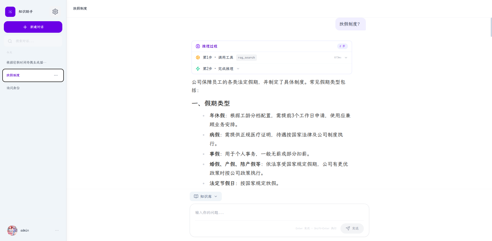
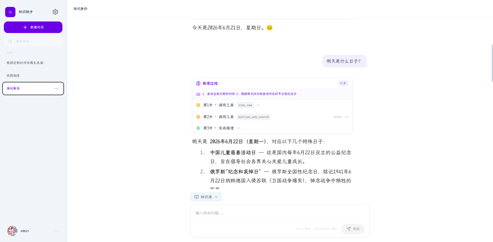
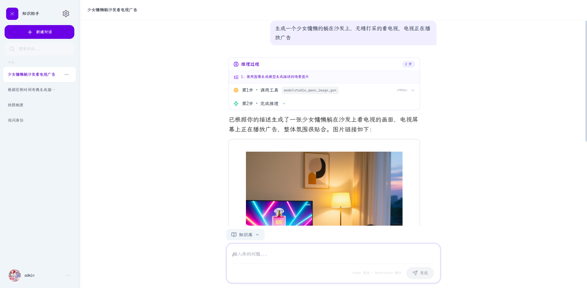
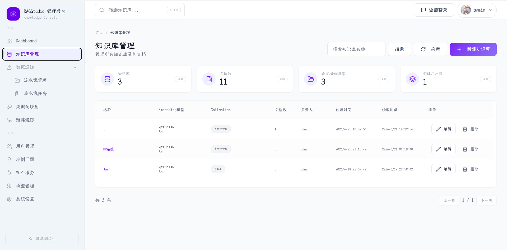
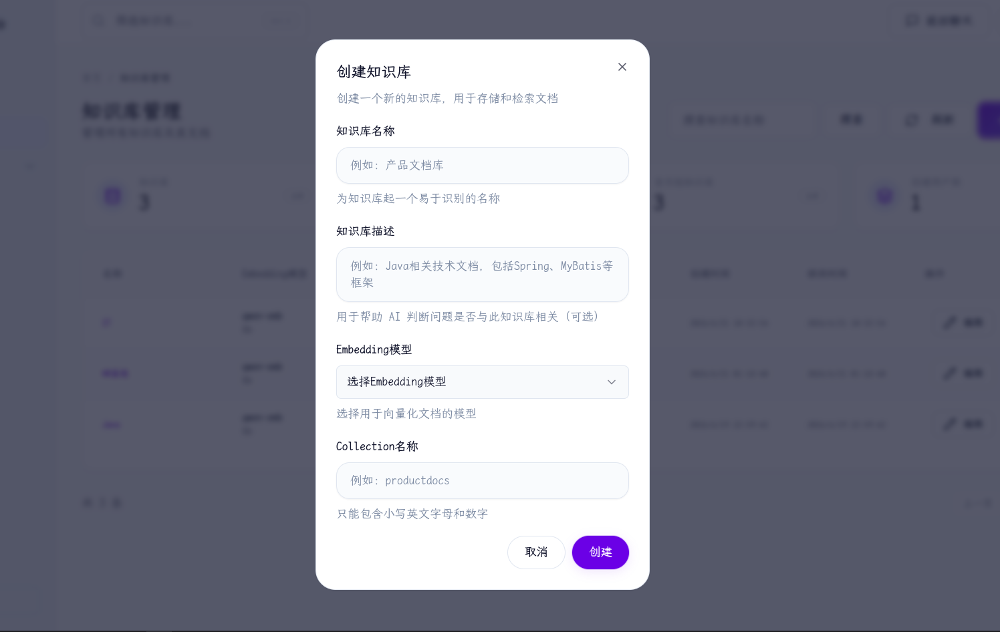
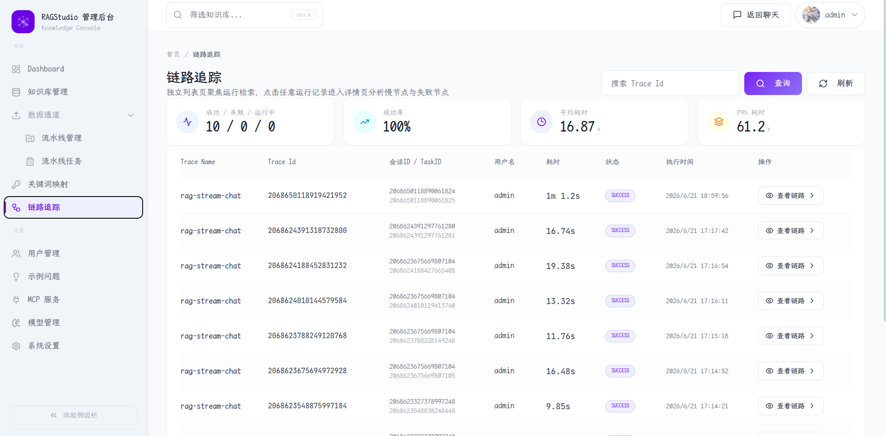
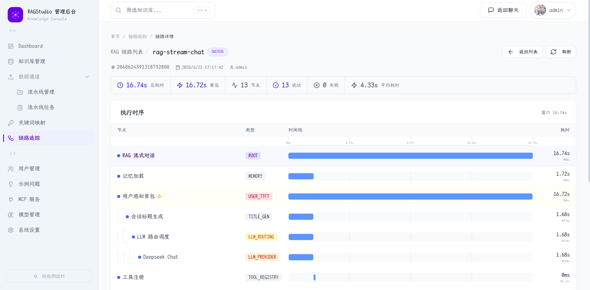
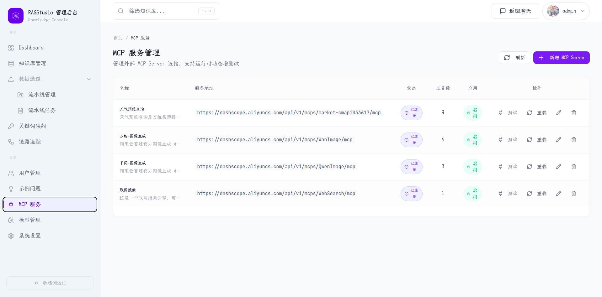
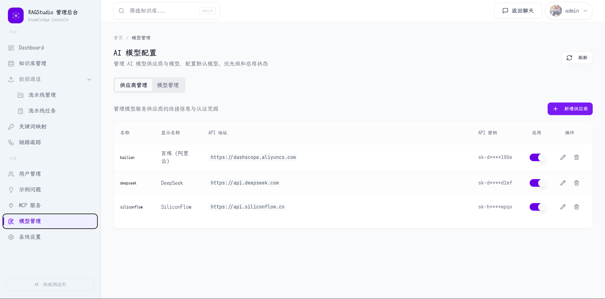

# RAGStudio — 企业级智能 Agent RAG 平台

<p align="center">
  <em>基于 ReACT Agent 循环的深度推理引擎 · 覆盖从文档入库到智能问答的完整链路</em>
</p>

<p align="center">
  <a href="README_en.md">
    
  </a>
</p>

---

## 📋 目录

- [项目简介](#项目简介)
- [架构总览](#架构总览)
- [核心功能](#核心功能)
- [技术栈](#技术栈)
- [项目结构](#项目结构)
- [分层架构](#分层架构)
- [快速开始](#快速开始)
- [API 示例](#api-示例)
- [配置说明](#配置说明)
- [截图展示](#截图展示)
- [项目文档](#项目文档)

---

## 项目简介

**RAGStudio** 是一个基于 **Java 17 + Spring Boot 3.5** 构建的企业级 AI 问答平台，默认采用 **ReACT Agent 循环**（Thought → Action → Observation），支持多步推理、链式工具调用和知识库自主检索。

### 核心能力

- **ReACT Agent 循环** — 用 Thought → Action → Observation 循环替代传统线性 RAG 管线，LLM 在循环中自主推理、调用工具、观察结果
- **多文档知识库** — 支持 PDF/DOCX/HTML/Markdown 等多种格式文档的解析、向量化存储和语义检索
- **多模型路由** — 数据库驱动的动态模型配置，支持百炼、SiliconFlow、DeepSeek 等多个 LLM 提供商，故障时秒级自动切换
- **MCP 协议集成** — 支持运行时动态发现和调用外部工具，Agent 在循环中自主决策调用
- **全链路追踪** — 自研轻量级分布式追踪系统，记录 RAG 管线的每个阶段

---

## 架构总览


### 双管线设计

RAGStudio 采用**双管线设计**：**Agent 模式为默认（`mode=agent`）**，RAG 模式作为 `mode=rag` 备选。

#### Agent 模式流程

```
用户提问
  │
  ▼
ChatQueueLimiter (分布式限流)
  │
  ▼
StreamChatPipeline.doExecuteAgent()
  │
  ├─ 1. 记忆加载 ─── 并行加载对话历史 + 摘要
  │
  ├─ 2. 工具注册 ─── MCP 工具 + rag_search 工具注册到 ToolRegistry
  │
  ├─ 3. KB 相关性判断 ─── 轻量 LLM 判断问题是否与所选知识库相关
  │
  └─ 4. Agent Loop ─── 迭代至 FINISH
        ├─ Thought → Action(TOOL_CALL) → Observation → 继续
        └─ Thought → Action(FINISH) → Final Answer（逐字流式推送）
```

#### RAG 模式流程

```
用户提问
  │
  ▼
StreamChatPipeline.doExecuteRag()
  │
  ├─ 1. 记忆加载
  ├─ 2. 查询改写 + MCP 决策
  ├─ 3. 多通道检索 + Rerank
  ├─ 4. MCP 工具执行（条件）
  └─ 5. 流式回答
```

---

## 核心功能

### 🤖 ReACT Agent 循环

Agent 模式为默认交互方式，LLM 在循环中自主推理和决策：

```
迭代 0:  Thought → 需要查日期
          Action → time_now({})
          Observation → 2026年6月21日

迭代 1:  Thought → 知道了日期，查节日
          Action → web_search({query: "6月21日 节日"})
          Observation → 父亲节

迭代 2:  Thought → 信息充分
          Action → FINISH
          Final Answer → 今天是2026年6月21日，父亲节。
```

- **Plan-then-Execute** — Agent 第一步输出 Plan 规划多步方案，后续按计划执行
- **知识库精准检索** — LLM 判断问题与哪些知识库相关（`relevant_collection_names`），只检索相关的
- **内置时间工具** — `time_now` 支持任意 IANA 时区（含夏令时自动处理），不依赖外部服务
- **MCP 工具调用** — MCP 工具通过适配器接入 ToolRegistry，Agent 在循环中自主决策调用
- **Agent 步骤持久化** — 推理步骤序列化为 JSON 存储在 `t_message.agent_steps`，前端可回放
- **缺参数先问** — 可搜索参数（日期）→ 搜索获取；用户参数（城市）→ 反问用户
- **格式校正** — LLM 未按要求输出 ReACT 格式时，自动注入纠正提示后重试一次

### 🧠 知识库关联性判断

进入 Agent 循环前，用轻量 LLM 调用判断问题与所选知识库是否相关：

- **按库精准过滤** — LLM 返回 `relevant_collection_names` 字段，指定具体哪些知识库相关，只检索这些
- **判断依据** — 知识库名称 + 知识库描述（创建/编辑时可填写）
- **JSON 断尾修复** — 处理 LLM 输出被截断的情况，确保解析健壮

### 📚 知识库管理

- 创建/编辑/删除知识库，支持配置 embedding 模型
- **知识库描述** — 创建和编辑时可填写描述，用于 AI 关联判断
- 文档上传（文件/URL），支持 PDF/DOCX/HTML/Markdown 格式
- 自动分块 + embedding 向量化入库
- 定时刷新同步（cron 表达式 + ETag/Hash 变更检测）
- 分块查看、启用/禁用、手动编辑

### ⚙️ 多模型路由与熔断降级

- 数据库驱动的动态模型配置，运行时无重启切换
- 优先级路由 + Circuit Breaker 状态机（CLOSED → OPEN → HALF_OPEN）
- 单模型故障秒级自动 fallback，流式场景与同步场景共享健康检查

### 🧩 MCP 集成

- MCP 服务器注册与管理，启动时异步加载不阻塞应用
- Agent 在循环中自主调用，支持多次调用和链式调用
- 工具调用失败时 Agent 可自主重试或换用其他工具

### 🖥️ 管理后台

- **仪表盘** — 用户量、对话量、消息量等核心 KPI 概览，延迟/成功率趋势
- **知识库管理** — 知识库列表、文档管理、分块详情、处理日志
- **摄入管道** — 管道定义与执行任务管理
- **RAG 链路追踪** — 全链路 trace 展示，节点级耗时查看
- **系统设置** — 模型参数、记忆配置、限流策略
- **MCP 服务** — 外部 MCP 服务器注册管理
- **用户管理** — 账号管理、角色分配

### 🔐 用户认证与权限

- Sa-Token 登录/注销（用户名+密码）
- 管理员 / 普通用户双角色权限

---

## 技术栈

| 层级 | 技术 |
|------|------|
| **后端** | Java 17, Spring Boot 3.5.7, MyBatis-Plus, RocketMQ, Sa-Token |
| **AI 引擎** | ReACT Agent Loop (Thought → Action → Observation) |
| **LLM 集成** | Spring AI (OpenAI 兼容协议), 多模型路由 + 熔断降级 |
| **向量存储** | PostgreSQL + pgvector (HNSW 索引) |
| **前端** | React 18, TypeScript, Vite, Tailwind CSS, shadcn/ui, Zustand |
| **缓存** | Redis + Redisson (分布式锁) |
| **文档解析** | Apache Tika 3.2 (PDF/DOCX/HTML/Markdown) |
| **协议** | MCP (Model Context Protocol) 1.1.2 |
| **对象存储** | S3 兼容存储 (RustFS / MinIO) |

---

## 项目结构

### 多模块 Maven 架构

```
ragstudio（父模块）
├── bootstrap          # 应用启动模块，包含所有业务代码
├── framework          # 基础框架层：缓存、数据库、安全、异常处理、MQ、分布式ID
└── infra-ai           # AI 基础设施层：LLM 客户端、Embedding、Rerank、模型路由
```

### 模块详解

#### `bootstrap` — 应用启动模块

包含完整的业务代码，按功能域（package-by-feature）组织：

```
bootstrap/src/main/java/com/byteq/ai/ragstudio/
├── admin/              # 管理后台仪表盘
├── aimodel/            # AI 模型配置管理
├── core/               # 文档解析与分块
├── ingestion/          # 摄入管道引擎
├── knowledge/          # 知识库管理
├── mcp/                # MCP 服务管理
├── rag/                # RAG 核心引擎
│   ├── controller/     # REST 控制器
│   ├── service/        # 业务服务层
│   │   ├── pipeline/   # 流式聊天管线
│   │   ├── handler/    # 流式事件处理
│   │   ├── ratelimit/  # 分布式限流
│   │   └── impl/       # 服务实现
│   ├── core/           # 核心引擎
│   │   ├── agent/      # ReACT Agent 循环
│   │   ├── retrieve/   # 多通道检索
│   │   ├── memory/     # 会话记忆管理
│   │   ├── prompt/     # 提示词模板
│   │   ├── rewrite/    # 查询改写
│   │   ├── vector/     # 向量存储抽象
│   │   └── mcp/        # MCP 工具注册与执行
│   └── dao/            # 数据访问层
│       ├── entity/     # 数据库实体
│       └── mapper/     # MyBatis Mapper
├── user/               # 用户认证与权限
└── RAGStudioApplication.java  # 启动入口
```

#### `framework` — 基础框架层

公共基础能力，被 bootstrap 模块依赖：

```
framework/src/main/java/com/byteq/ai/ragstudio/framework/
├── cache/               # Redis 序列化
├── config/              # 自动配置 (DB, MQ, Web)
├── context/             # 用户上下文
├── convention/          # 通用数据契约
├── database/            # MyBatis-Plus 元数据处理器
├── distributedid/       # 分布式 ID 生成器
├── errorcode/           # 错误码定义
├── exception/           # 统一异常体系
├── idempotent/          # 幂等提交保证
├── mq/                  # RocketMQ 消息队列封装
├── security/            # 密码哈希
├── trace/               # 轻量级分布式追踪
└── web/                 # 全局异常处理等
```

#### `infra-ai` — AI 基础设施层

AI 相关客户端与路由逻辑，被 bootstrap 模块依赖：

```
infra-ai/src/main/java/com/byteq/ai/ragstudio/infra/
├── chat/                # LLM 聊天客户端
│   └── client/          # 各厂商实现：百炼、DeepSeek、SiliconFlow
├── config/              # 动态模型配置
├── embedding/           # Embedding 客户端
├── enums/               # 模型提供商枚举
├── http/                # HTTP 客户端封装
├── model/               # 模型路由与健康检查
├── rerank/              # Rerank 排序服务
├── springai/            # Spring AI 适配器
├── token/               # Token 计数
└── util/                # LLM 响应清理
```

---

## 分层架构

RAGStudio 在每个模块内部采用标准的**四层架构**：

```
┌─────────────────────────────────────────────────────────┐
│                    Controller 层                          │
│              REST API 入口 / 请求校验 / 响应封装            │
├─────────────────────────────────────────────────────────┤
│                    Service 层                             │
│              业务逻辑编排 / 事务管理 / 领域服务              │
├─────────────────────────────────────────────────────────┤
│                    DAO 层                                 │
│              Mapper (MyBatis-Plus) + Entity               │
├─────────────────────────────────────────────────────────┤
│                  Database (PostgreSQL)                     │
│                       + Redis                             │
└─────────────────────────────────────────────────────────┘
```

### 分层职责

| 层级 | 职责 | 典型注解 |
|------|------|---------|
| **Controller** | HTTP 请求接收、参数校验、VO 封装返回 | `@RestController`, `@RequestMapping`, `@Valid` |
| **Service** | 业务逻辑编排、事务管理、跨领域协调 | `@Service`, `@Transactional`, `@Async` |
| **Service.Impl** | 服务接口实现 | `@Service` |
| **DAO.Mapper** | MyBatis 数据映射、SQL 定义 | `@Mapper`, `BaseMapper<T>` |
| **DAO.Entity** | 数据库表映射实体 | `@TableName`, `@TableId`, `@TableField` |
| **VO / DTO** | 视图层对象 / 数据传输对象 | `@Data` |

### 典型代码组织

以知识库模块为例：

```
knowledge/
├── controller/                 # REST 接口层
│   ├── KnowledgeBaseController.java
│   ├── request/                # 请求参数对象
│   └── vo/                     # 响应视图对象
├── service/                    # 业务服务接口
│   ├── KnowledgeBaseService.java
│   └── impl/
│       └── KnowledgeBaseServiceImpl.java
├── dao/                        # 数据访问层
│   ├── entity/                 # 数据库实体
│   │   └── KnowledgeBaseDO.java
│   └── mapper/                 # MyBatis Mapper
│       └── KnowledgeBaseMapper.java
├── enums/                      # 枚举定义
├── mq/                         # 消息队列事件
└── schedule/                   # 定时任务
```

### 核心 Agent 系统文件

```
bootstrap/src/main/java/com/byteq/ai/ragstudio/rag/core/agent/
├── AgentLoop.java                   # ReACT 循环引擎
├── AgentContext.java                # 循环上下文
├── AgentStep.java                   # 单步记录
├── ReActResponseParser.java         # 三级降级解析器
├── ReActPromptBuilder.java          # System Prompt 构建器
├── Tool.java                        # 统一工具接口
├── ToolRegistry.java                # 工具注册中心（30 秒超时）
├── ToolResult.java                  # 工具执行结果
├── McpToolAdapter.java              # MCP → 通用工具适配器
├── RagSearchTool.java               # 知识库检索工具
├── TimeTool.java                    # 时间工具
└── KbRelevanceChecker.java          # KB 相关性判断
```

### 检索系统文件

```
bootstrap/src/main/java/com/byteq/ai/ragstudio/rag/core/retrieve/
├── channel/
│   ├── SearchChannel.java                  # 检索通道接口
│   ├── SearchChannelType.java              # 通道类型枚举
│   ├── VectorGlobalSearchChannel.java      # 向量全局检索
│   ├── KnowledgeBaseSelectionChannel.java  # 知识库选择检索
│   └── AbstractParallelRetriever.java      # 并行检索抽象类
├── postprocessor/
│   ├── SearchResultPostProcessor.java      # 后置处理器接口
│   ├── DeduplicationPostProcessor.java     # 去重处理器
│   └── RerankPostProcessor.java            # Rerank 重排序
├── MultiChannelRetrievalEngine.java        # 多通道检索引擎
├── RetrievalEngine.java                    # 检索引擎接口
├── RetrieverService.java                   # 检索服务接口
├── PgRetrieverService.java                 # pgvector 检索实现
└── RetrieveRequest.java                    # 检索请求对象
```

---

## 快速开始

### 环境要求

| 依赖 | 版本要求 | 用途 |
|------|---------|------|
| **JDK** | 17+ | 后端运行 |
| **Maven** | 3.8+ | 项目构建 |
| **Node.js** | 18+ | 前端构建 |
| **npm** | 9+ | 前端包管理 |
| **PostgreSQL** | 14+（需 pgvector 扩展） | 业务数据 + 向量存储 |
| **Redis** | 6+ | 缓存 + 分布式锁 |
| **RocketMQ** | 5.2.0 | 异步消息队列 |
| **Docker** | 最新 | 容器化基础设施运行 |

### 启动基础设施

#### 方法一：使用 Docker（推荐）

RocketMQ（消息队列）：

```bash
docker compose -f resources/docker/rocketmq-stack-5.2.0.compose.yaml up -d
```

PostgreSQL（含 pgvector）和 Redis：

```bash
# PostgreSQL with pgvector
docker run -d --name pgvector \
  -e POSTGRES_DB=ragstudio \
  -e POSTGRES_USER=postgres \
  -e POSTGRES_PASSWORD=postgres \
  -p 5432:5432 \
  pgvector/pgvector:pg16

# Redis
docker run -d --name redis \
  -p 6379:6379 \
  redis:7-alpine
```

#### 方法二：手动安装

- **PostgreSQL 14+**：需安装 [pgvector](https://github.com/pgvector/pgvector) 扩展
- **Redis 6+**：默认端口 6379
- **RocketMQ 5.2.0**：参考 [官方文档](https://rocketmq.apache.org/docs/quick-start/)

### 初始化数据库

```bash
# 创建数据库
createdb -U postgres ragstudio

# 执行建表脚本
psql -U postgres -d ragstudio -f resources/database/V2/schema_pg.sql

# 导入初始数据
psql -U postgres -d ragstudio -f resources/database/V2/init_data_pg.sql
```

### 配置环境变量

```bash
# 从示例复制并编辑
cp .env-example .env

# 根据你的环境修改配置，填入实际的数据库、Redis、RocketMQ 等连接信息
```

`.env` 文件包含以下配置项：

| 环境变量 | 说明 | 默认值 |
|---------|------|--------|
| `DB_USERNAME` | 数据库用户名 | `postgres` |
| `DB_PASSWORD` | 数据库密码 | `postgres` |
| `DB_URL` | 数据库连接地址 | `jdbc:postgresql://localhost:5432/ragstudio` |
| `REDIS_HOST` | Redis 主机 | `localhost` |
| `REDIS_PORT` | Redis 端口 | `6379` |
| `REDIS_PASSWORD` | Redis 密码 | _(空)_ |
| `ROCKETMQ_NAMESERVER` | RocketMQ 命名服务地址 | `localhost:9876` |
| `RUSTFS_URL` | S3 对象存储地址 | `http://localhost:9000` |
| `RUSTFS_ACCESS_KEY` | S3 访问密钥 | `minioadmin` |
| `RUSTFS_SECRET_KEY` | S3 秘密密钥 | `minioadmin` |

### 启动后端

```bash
# 方式一：Maven 直接启动
cd bootstrap && mvn spring-boot:run

# 方式二：打包后启动
mvn clean package -DskipTests
cd bootstrap/target
java -jar bootstrap-0.0.1-SNAPSHOT.jar
```

后端启动后，API 地址：**http://localhost:9090/api/ragstudio**

### 启动前端

```bash
cd frontend
npm install   # 仅首次需要
npm run dev
```

前端启动后，访问地址：**http://localhost:5173**

---

## API 示例

### 1. Agent 模式（默认）

```bash
curl -X POST http://localhost:9090/api/ragstudio/rag/v3/chat \
  -H "Content-Type: application/json" \
  -H "Authorization: <token>" \
  -d '{"question": "HashMap的原理是什么？"}'
```

### 2. Agent 模式 + 知识库

```bash
curl -X POST http://localhost:9090/api/ragstudio/rag/v3/chat \
  -H "Content-Type: application/json" \
  -H "Authorization: <token>" \
  -d '{
    "question": "公司年假怎么申请？",
    "knowledgeBaseIds": ["kb-001"]
  }'
```

### 3. RAG 模式

```bash
curl -X POST http://localhost:9090/api/ragstudio/rag/v3/chat \
  -H "Content-Type: application/json" \
  -H "Authorization: <token>" \
  -d '{
    "question": "公司年假怎么申请？",
    "knowledgeBaseIds": ["kb-001"],
    "mode": "rag"
  }'
```

---

## 配置说明

### 应用配置

`bootstrap/src/main/resources/application.yaml` 中的核心配置段：

| 配置项 | 描述 | 默认值 |
|--------|------|--------|
| `rag.agent.max-iterations` | Agent 循环最大迭代次数 | `10` |
| `rag.agent.tool-timeout-ms` | 单工具调用超时 | `30000` |
| `rag.search.default-top-k` | 检索返回 Top-K 条数 | `5` |
| `rag.memory.history-keep-turns` | 保留最近 N 轮对话历史 | `4` |
| `rag.memory.summary-start-turns` | 从第 N 轮开始启用摘要 | `5` |
| `rag.memory.summary-enabled` | 是否启用对话摘要 | `true` |
| `rag.trace.enabled` | 是否启用全链路追踪 | `true` |
| `rag.rate-limit.global.max-concurrent` | 全局最大并发数 | `1` |

### 数据库初始化脚本

```bash
resources/database/
├── V2/
│   ├── schema_pg.sql          # 建表脚本
│   └── init_data_pg.sql       # 初始数据
├── upgrade_v1.0_to_v1.1.sql   # 版本升级 (v1.0 → v1.1)
└── upgrade_v1.1_to_v1.2.sql   # 版本升级 (v1.1 → v1.2)
```

---

## 截图展示

### 对话与 Agent

| 对话界面 | Agent 推理展示 |
|:---:|:---:|
|  |  |

| Agent 推理步骤 |
|:---:|
|  |

### 知识库

| 知识库管理 | 知识库详情 |
|:---:|:---:|
|  |  |

### 链路追踪

| 链路追踪总览 |
|:---:|
|  |

| 追踪详情 |
|:---:|
|  |

### MCP

| MCP 服务管理 |
|:---:|
|  |

### 模型管理

| 模型配置 |
|:---:|
|  |

---

## 项目文档

- [快速开始指南](docs/quick-start.md) — 更详细的启动说明
- [多通道检索架构](docs/multi-channel-retrieval.md) — 检索系统设计文档
- [PDF 摄入示例](docs/examples/pdf-ingestion-example.md) — PDF 文档处理示例
- [Docker 轻量部署](resources/docker/lightweight/README.md) — 低资源环境部署

---

<p align="center">
  Built with ❤️ by ByteQ<br/>
  <a href="LICENSE">MIT License</a>
</p>
