# RAGStudio — Agentic RAG Platform

<p align="center">
  <em>Retrieval-Augmented Generation platform powered by ReACT Agent loop</em>
</p>

<p align="center">
  <a href="README_cn.md">
    
  </a>
</p>

---

## Table of Contents

- [Introduction](#introduction)
- [Architecture Overview](#architecture-overview)
- [Screenshots](#screenshots)
- [Core Features](#core-features)
- [Technology Stack](#technology-stack)
- [Project Structure](#project-structure)
- [Layered Architecture](#layered-architecture)
- [Quick Start](#quick-start)
- [API Examples](#api-examples)
- [Configuration Guide](#configuration-guide)
- [Documentation](#documentation)

---

## Introduction

**RAGStudio** is an AI Q&A platform built on **Java 17 + Spring Boot 3.5**. It uses the **ReACT Agent loop** (Thought → Action → Observation) for all requests. The LLM autonomously reasons, calls tools (including knowledge base retrieval), observes results, and iterates until it produces a final answer.

### Core Capabilities

- **ReACT Agent Loop** — Replaces traditional linear RAG pipeline with a reasoning loop where the LLM autonomously thinks, acts, and observes
- **Multi-Document Knowledge Base** — Parses, vectorizes, and enables semantic search across PDF, DOCX, HTML, Markdown and more
- **Multi-Model Routing** — Database-driven dynamic model config with automatic failover across providers like BaiLian, SiliconFlow, DeepSeek
- **MCP Protocol Integration** — Dynamic discovery and invocation of external tools via MCP protocol, autonomously decided by the Agent
- **Full-Chain Tracing** — Built-in lightweight distributed tracing capturing every stage of the RAG pipeline

---

## Architecture Overview


### Agent Pipeline

All requests go through the Agent loop. The Agent autonomously reasons, calls tools (including retrieval tools), observes results, and iterates until it produces a final answer.

```
User Question
  │
  ▼
ChatQueueLimiter (Distributed Rate Limiting)
  │
  ▼
StreamChatPipeline.doExecuteAgent()
  │
  ├─ 1. Memory Loading ─── Parallel loading of conversation history + summary
  │
  ├─ 2. Tool Registration ─── MCP tools + rag_search registered in ToolRegistry
  │
  ├─ 3. KB Relevance Check ─── Lightweight LLM checks relevance to selected KBs
  │
  └─ 4. Agent Loop ─── Iterate until FINISH
        ├─ Thought → Action(TOOL_CALL) → Observation → Continue
        └─ Thought → Action(FINISH) → Final Answer (streaming)
```


---

## Screenshots

### Chat

| Chat Interface |
|:-------------:|
| 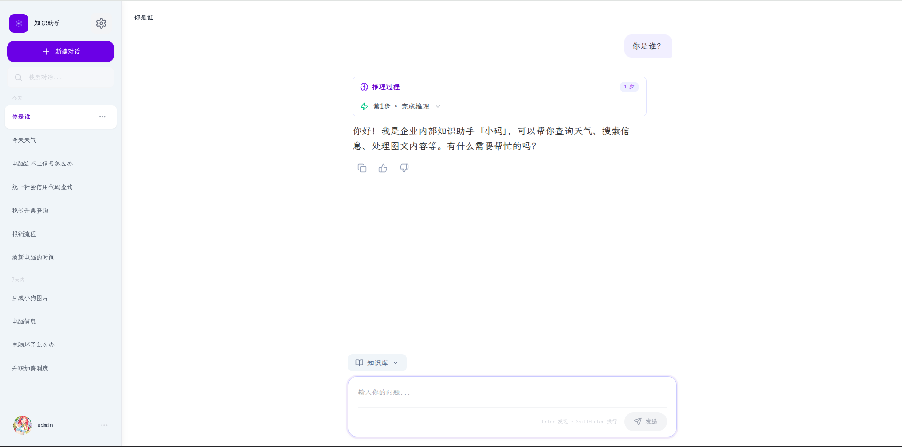 |

### Knowledge Base

| KB Management | Document Management | Search (Semantic) |
|:-------------:|:------------------:|:-----------------:|
| 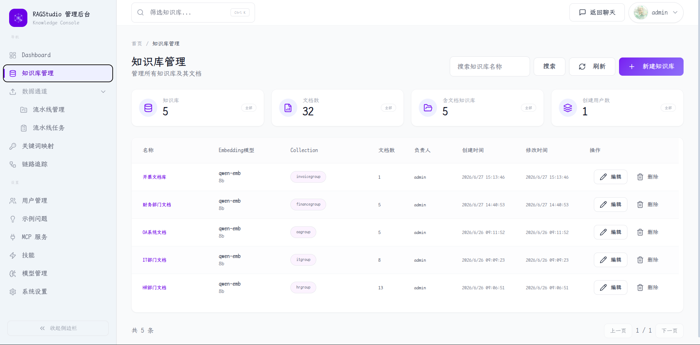 | 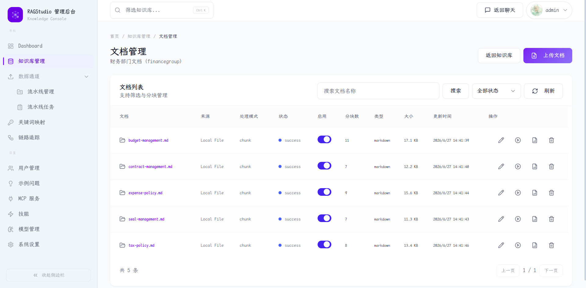 | 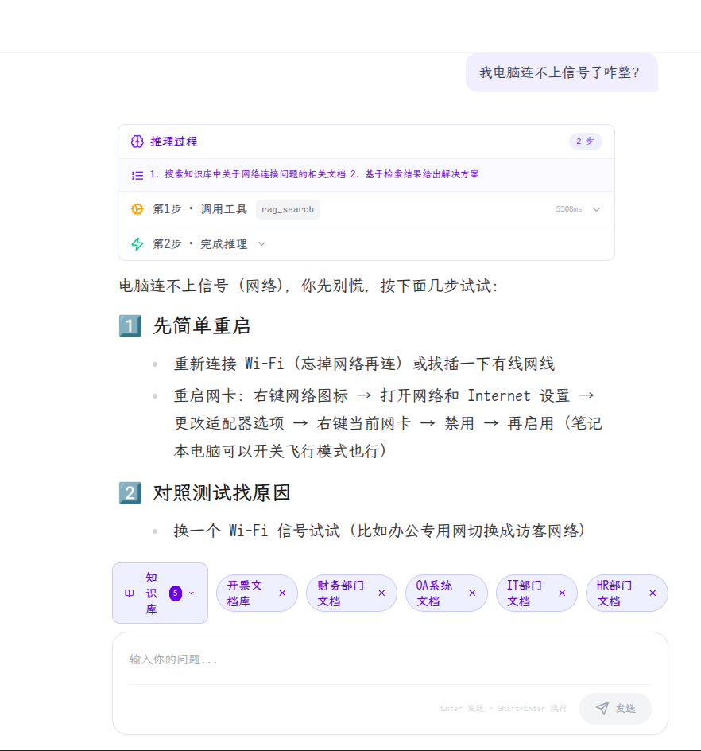 |

| KB Details | Search (Keyword) |
|:----------:|:----------------:|
| 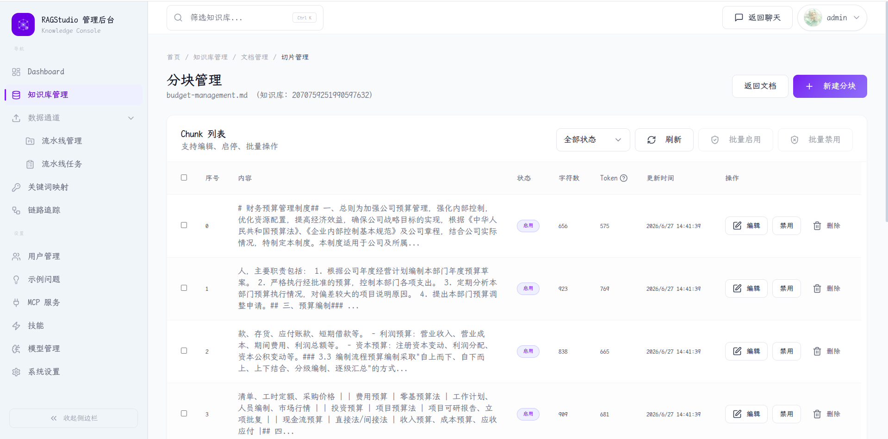 | 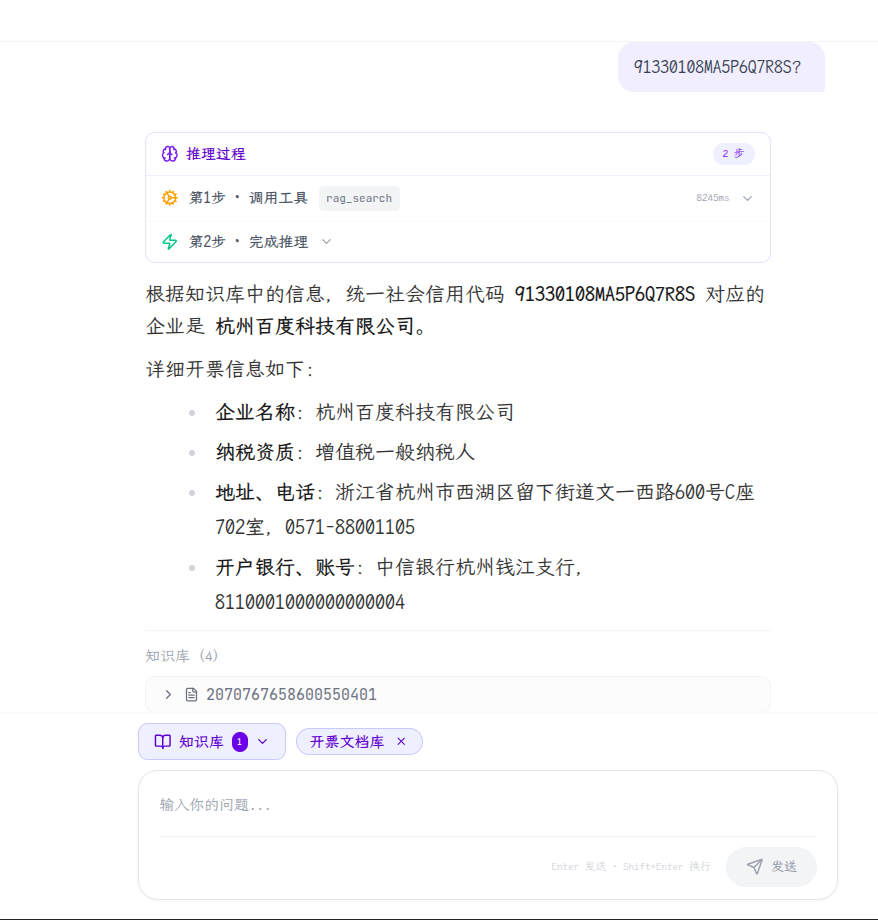 |

### Trace

| Trace Overview | Trace Details |
|:-------------:|:-------------:|
| 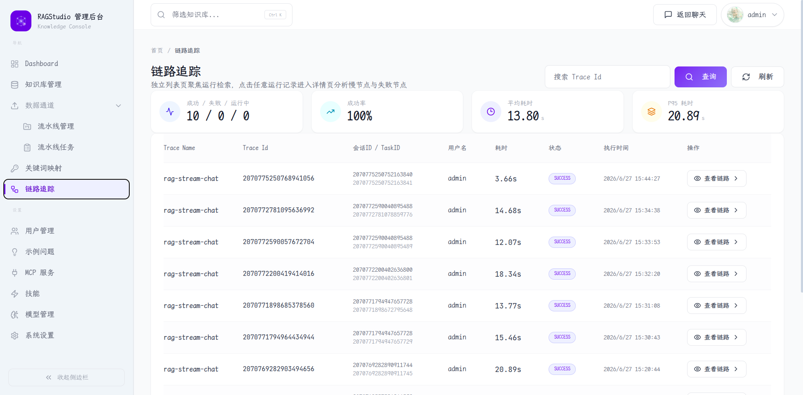 | 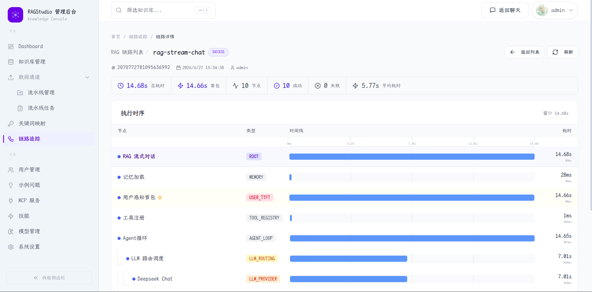 |

### Ingestion Pipeline

| Pipeline Management | Pipeline Tasks |
|:------------------:|:-------------:|
| 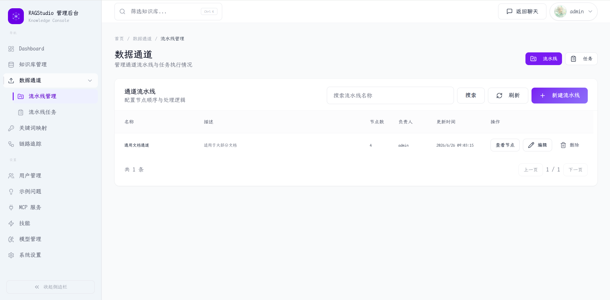 | 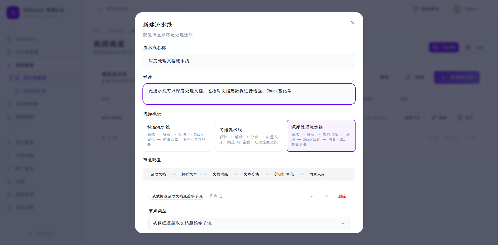 |

| Task Details |
|:-----------:|
| 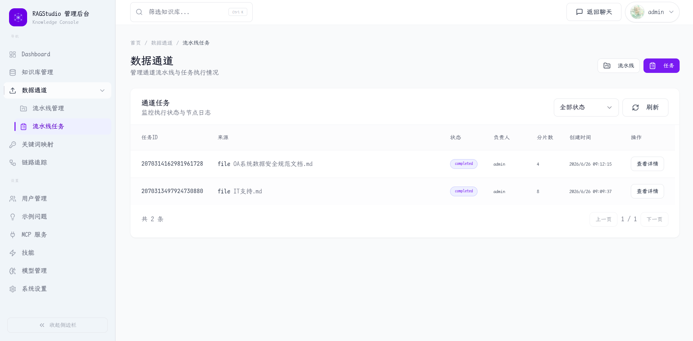 |

### Models

| Model List |
|:---------:|
| 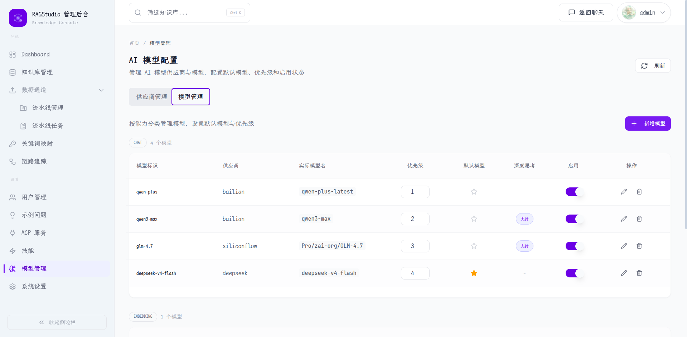 |

### MCP

| MCP Server Management | MCP Tool Call |
|:--------------------:|:-------------:|
|  | 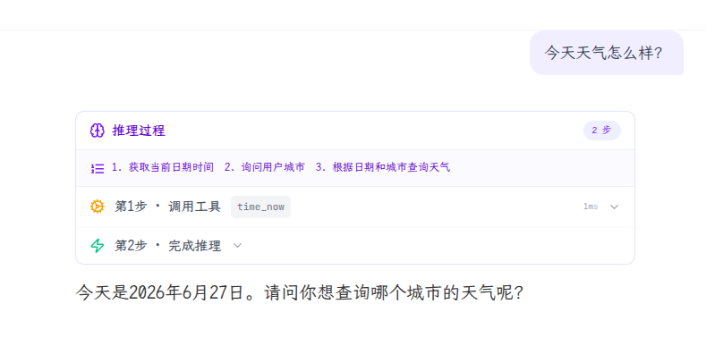 |

| MCP Call Details |
|:---------------:|
| 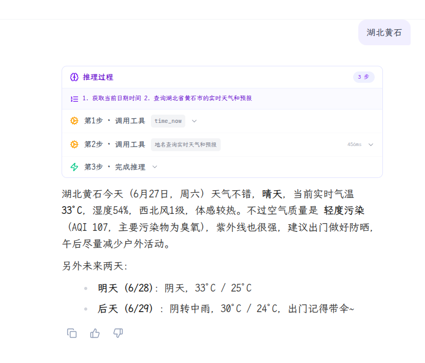 |

### SKILL

| SKILL List |
|:---------:|
| 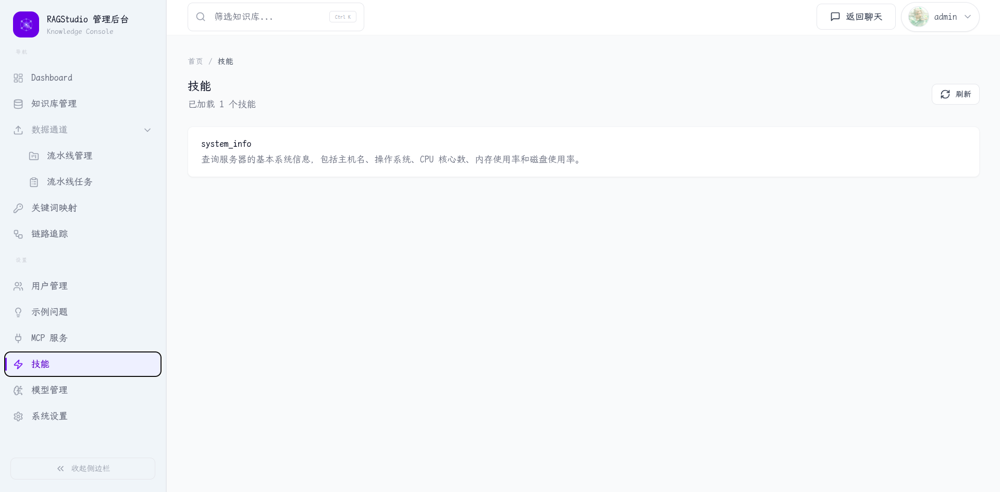 |

### Dashboard

| Dashboard Overview |
|:-----------------:|
| 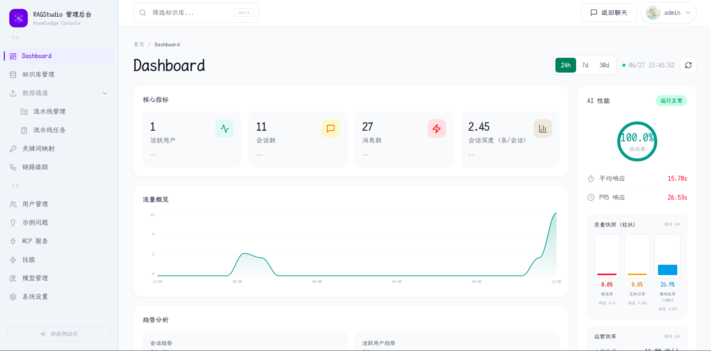 |

---

## Core Features

### ReACT Agent Loop

Agent mode is the default interaction style — the LLM reasons and decides autonomously in a loop:

```
Iteration 0:  Thought → Need to check date
               Action → time_now({})
               Observation → June 21, 2026

Iteration 1:  Thought → Date known, check festival
               Action → web_search({query: "June 21 holiday"})
               Observation → Father's Day

Iteration 2:  Thought → Information sufficient
               Action → FINISH
               Final Answer → Today is June 21, 2026. It's Father's Day.
```

- **Plan-then-Execute** — The Agent first outputs a multi-step plan, then executes step by step
- **Precise KB Retrieval** — LLM determines which knowledge bases are relevant (`relevant_collection_names`) and retrieves only from those
- **Built-in Time Tool** — `time_now` supports any IANA timezone with automatic DST handling, no external service needed
- **MCP Tool Calling** — MCP tools connect via adapters to the ToolRegistry, called autonomously by the Agent
- **Step Persistence** — Reasoning steps are serialized as JSON in `t_message.agent_steps` for frontend replay
- **Missing Parameters** — Searchable params (dates) are auto-retrieved; user-specific params (cities) prompt a clarifying question
- **Format Correction** — If the LLM fails to output ReACT format, an automatic correction prompt is injected and retried once

### KB Relevance Check

Before entering the Agent loop, a lightweight LLM call determines if the question is relevant to the selected knowledge bases.

- **Per-KB Filtering** — The LLM returns `relevant_collection_names` to specify which KBs are relevant — only those are searched
- **Judgment Criteria** — Based on KB name and description (configurable during creation/editing)
- **Truncation Recovery** — Handles truncated LLM responses to ensure robust parsing

### Knowledge Base Management

- **CRUD Operations** — Create, edit, delete knowledge bases with configurable embedding models
- **KB Description** — Descriptions help AI determine KB relevance during Q&A
- **Multi-format Upload** — Upload documents via file or URL in PDF, DOCX, HTML, Markdown formats
- **Auto Chunking & Vectorization** — Automatic document chunking and embedding vectorization
- **Scheduled Sync** — Cron-based refresh with ETag/Hash change detection
- **Chunk Management** — View, enable/disable, and manually edit chunks

### Hybrid Search

Default mode runs **vector search + keyword search in parallel**, fused via RRF (Reciprocal Rank Fusion):

- **Vector channel**: pgvector cosine similarity (HNSW index) — semantic matching
- **Keyword channel**: PostgreSQL tsvector full-text search (GIN index), `plainto_tsquery` + `ts_rank` — exact match for proper nouns, codes, model numbers
- **RRF fusion**: `score = Σ 1/(60 + rank)` — both channels contribute, no manual weight tuning

### Citation Trace

When the Agent's answer references knowledge base content, `[^chunk_{id}]` markers are automatically converted to numbered `[N]` references — blue clickable links inline in the answer text. Clicking scrolls to and expands the corresponding entry in the citation list below.

- **Inline numbered references**: `[^chunk_{id}]` → `[N]`, numbered by first-appearance order, click to expand the chunk
- **Citation list**: Displays `[N]`, Chunk ID, knowledge base name, and document name — expand to view full text
- **Copy Chunk ID**: Each citation includes a copy button that copies only the Chunk ID
- **Backend filtering**: `fireCitations()` only sends chunks actually referenced by `[^chunk_id]` markers in the answer
- **Persistence**: Citations saved in `t_message.citations`, surviving page refreshes

### Chunking Strategies

Three chunking strategies available, configurable per knowledge base:

**Overlap chunking (`fixed_size`)**
- Splits text into fixed-size chunks with configurable overlap to preserve context across boundaries
- Default chunk size: 512 chars, overlap: 128 chars
- Respects sentence boundaries (Chinese 。！？ and English .!?) — won't split mid-sentence
- Handles URL line-break issues automatically

**Recursive chunking (`recursive`)**
- Inspired by LangChain RecursiveCharacterTextSplitter
- Multi-level separators, coarse-to-fine: `\n\n` → `\n` → `。` → `！` → `？` → `. ` → `，`
- Automatically falls back to finer separators when a chunk exceeds the size limit
- Supports configurable overlap

**Structure-aware chunking (`structure_aware`)**
- Designed for Markdown documents — recognizes headings, code fences, paragraphs
- Uses min/target/max budget packing (default 600/1400/1800 chars)
- Keeps headings and their content together, won't split them across chunks
- Supports block-level overlap and automatic trailing-small-chunk merging

### Multi-Model Routing & Circuit Breaker

- **Dynamic Configuration** — Database-driven model configuration with zero-downtime runtime switching
- **Circuit Breaker FSM** — Priority-based routing with circuit breaker state machine (CLOSED → OPEN → HALF_OPEN)
- **Instant Failover** — Second-level automatic fallback with shared health checks for streaming and sync scenarios

### MCP Integration

- **MCP Server Management** — Register and manage MCP servers; async loading on startup doesn't block the app
- **Autonomous Tool Calls** — The Agent autonomously invokes tools in its loop, supporting multi-turn and chained calls
- **Failure Retry** — On tool failure, the Agent can retry or switch to alternative tools

### SKILL System

Users define custom Agent tools by writing a YAML file into the `skills/` directory — no Java code or MCP server needed.

- **Directory structure**: `skills/{name}/skill.yaml` + `SKILL.md` (documentation) + `scripts/` (executable scripts) + `references/` (reference materials)
- **Auto-loading**: Scanned at startup → cached in Redis, 15-second polling hot-reload, file changes take effect without restart
- **Tool types**: `http` (call external APIs), `script` (execute scripts), `command` (execute commands)
- **Built-in reader**: `skill_reader` tool lets the LLM read SKILL.md, browse scripts and references during Agent loops
- **Management API**: `GET /admin/skills` (list), `POST /admin/skills/reload` (refresh)

#### Security Sandbox

`script` and `command` type SKILLs run in Docker containers instead of directly on the host:

- `--read-only` — root filesystem is read-only
- `--cap-drop=ALL` — all Linux capabilities removed
- `--user 1000:1000` — runs as non-root
- `--tmpfs /tmp:size=1G,noexec` — temp files limited to 1GB, no execution
- `--memory=256m --cpus=0.5 --pids-limit=50` — resource limits
- `--network=none` — no network by default
- Commands pass through `SecurityAuditor` blacklist check (`rm -rf /`, `sudo`, reverse shells, internal network scanning blocked)
- 30-second timeout → automatic `docker kill`

### Admin Dashboard

- **Dashboard** — Core KPIs: user count, conversation count, message volume, latency/success rate trends
- **KB Management** — KB list, document management, chunk details, processing logs
- **Ingestion Pipeline** — Pipeline definition and task execution management
- **RAG Trace** — Full-chain trace visualization with node-level latency inspection
- **System Settings** — Model parameters, memory config, rate limiting strategies
- **MCP Services** — External MCP server registration and management
- **User Management** — Account management and role assignment

### User Authentication & Authorization

- Sa-Token login/logout (username + password)
- Admin / Regular user dual-role access control

---

## Technology Stack

| Layer | Technology |
|-------|-----------|
| **Backend** | Java 17, Spring Boot 3.5.7, MyBatis-Plus, RocketMQ, Sa-Token |
| **AI Engine** | ReACT Agent Loop (Thought → Action → Observation) |
| **LLM Integration** | Spring AI (OpenAI-compatible), Multi-Model Routing + Circuit Breaker |
| **Vector Store** | PostgreSQL + pgvector (HNSW index) + tsvector full-text search (GIN index) |
| **Frontend** | React 18, TypeScript, Vite, Tailwind CSS, shadcn/ui, Zustand |
| **Cache** | Redis + Redisson (Distributed Lock) |
| **Document Parsing** | Apache Tika 3.2 (PDF/DOCX/HTML/Markdown) |
| **Protocol** | MCP (Model Context Protocol) 1.1.2 |
| **Object Storage** | S3-compatible (RustFS / MinIO) |

---

## Project Structure

### Multi-Module Maven Architecture

```
ragstudio (Parent POM)
├── bootstrap          # Application bootstrap with all business code
├── framework          # Foundation: cache, database, security, exceptions, MQ, distributed IDs
└── infra-ai           # AI infrastructure: LLM clients, Embedding, Rerank, model routing
```

### Module Details

#### `bootstrap` — Application Bootstrap

Contains all business code, organized by feature domain:

```
bootstrap/src/main/java/com/byteq/ai/ragstudio/
├── admin/              # Admin Dashboard
├── aimodel/            # AI Model Configuration
├── core/               # Document Parsing & Chunking
├── ingestion/          # Ingestion Pipeline Engine
├── knowledge/          # Knowledge Base Management
├── mcp/                # MCP Server Management
├── rag/                # RAG Core Engine
│   ├── controller/     # REST Controllers
│   ├── service/        # Business Services
│   │   ├── pipeline/   # Streaming Chat Pipeline
│   │   ├── handler/    # Streaming Event Handlers
│   │   ├── ratelimit/  # Distributed Rate Limiting
│   │   └── impl/       # Service Implementations
│   ├── core/           # Core Engine
│   │   ├── agent/      # ReACT Agent Loop
│   │   ├── retrieve/   # Multi-Channel Retrieval
│   │   ├── memory/     # Conversation Memory
│   │   ├── prompt/     # Prompt Templates
│   │   ├── rewrite/    # Query Rewriting
│   │   ├── vector/     # Vector Store Abstractions
│   │   └── mcp/        # MCP Tool Registry & Execution
│   └── dao/            # Data Access Layer
│       ├── entity/     # Database Entities
│       └── mapper/     # MyBatis Mapper
├── user/               # User Auth & Permissions
└── RAGStudioApplication.java  # Main Entry
```

#### `framework` — Foundation Framework

Shared foundation capabilities consumed by the bootstrap module:

```
framework/src/main/java/com/byteq/ai/ragstudio/framework/
├── cache/               # Redis Serialization
├── config/              # Auto Configuration (DB, MQ, Web)
├── context/             # User Context
├── convention/          # Common Data Contracts
├── database/            # MyBatis-Plus Meta Object Handler
├── distributedid/       # Snowflake ID Generator
├── errorcode/           # Error Code Definitions
├── exception/           # Unified Exception Hierarchy
├── idempotent/          # Idempotent Submit
├── mq/                  # RocketMQ Wrapper
├── security/            # Password Hashing
├── trace/               # Distributed Tracing
└── web/                 # Global Exception Handler etc.
```

#### `infra-ai` — AI Infrastructure

AI client and routing logic consumed by the bootstrap module:

```
infra-ai/src/main/java/com/byteq/ai/ragstudio/infra/
├── chat/                # LLM Chat Clients
│   └── client/          # Providers: BaiLian, DeepSeek, SiliconFlow
├── config/              # Dynamic Model Configuration
├── embedding/           # Embedding Clients
├── enums/               # Model Provider Enums
├── http/                # HTTP Client Utilities
├── model/               # Model Routing & Health
├── rerank/              # Rerank Services
├── springai/            # Spring AI Adapter
├── token/               # Token Counting
└── util/                # LLM Response Cleaner
```

---

## Layered Architecture

Each module follows a standard **four-layer architecture**:

```
┌─────────────────────────────────────────────────────────┐
│                    Controller Layer                       │
│        REST API Entry / Request Validation / Response     │
├─────────────────────────────────────────────────────────┤
│                    Service Layer                          │
│         Business Logic Orchestration / Transaction Mgmt   │
├─────────────────────────────────────────────────────────┤
│                    DAO Layer                              │
│            Mapper (MyBatis-Plus) + Entity (ORM Mapping)   │
├─────────────────────────────────────────────────────────┤
│                  Database (PostgreSQL)                     │
│                       + Redis                             │
└─────────────────────────────────────────────────────────┘
```

### Layer Responsibilities

| Layer | Responsibility | Typical Annotations |
|-------|---------------|-------------------|
| **Controller** | Receives HTTP requests, validates params, wraps VO responses | `@RestController`, `@RequestMapping`, `@Valid` |
| **Service** | Orchestrates business logic, manages transactions, coordinates domains | `@Service`, `@Transactional`, `@Async` |
| **Service.Impl** | Implements service interfaces | `@Service` |
| **DAO.Mapper** | MyBatis data mapping and SQL definitions | `@Mapper`, `BaseMapper<T>` |
| **DAO.Entity** | Database table entity mappings | `@TableName`, `@TableId`, `@TableField` |
| **VO / DTO** | View objects / Data transfer objects | `@Data` |

### Typical Code Organization

Using the Knowledge Base module as an example:

```
knowledge/
├── controller/                 # REST Layer
│   ├── KnowledgeBaseController.java
│   ├── request/                # Request Params
│   └── vo/                     # Response VOs
├── service/                    # Service Interfaces
│   ├── KnowledgeBaseService.java
│   └── impl/
│       └── KnowledgeBaseServiceImpl.java
├── dao/                        # Data Access Layer
│   ├── entity/                 # Entities
│   │   └── KnowledgeBaseDO.java
│   └── mapper/                 # MyBatis Mapper
│       └── KnowledgeBaseMapper.java
├── enums/                      # Enums
├── mq/                         # MQ Events
└── schedule/                   # Scheduled Jobs
```

### Core Agent System Files

```
bootstrap/src/main/java/com/byteq/ai/ragstudio/rag/core/agent/
├── AgentLoop.java                   # ReACT Loop Engine
├── AgentContext.java                # Loop Context
├── AgentStep.java                   # Step Recording
├── ReActResponseParser.java         # 3-Level Fallback Parser
├── ReActPromptBuilder.java          # System Prompt Builder
├── Tool.java                        # Unified Tool Interface
├── ToolRegistry.java                # Tool Registry (30s timeout)
├── ToolResult.java                  # Tool Execution Result
├── McpToolAdapter.java              # MCP to Tool Adapter
├── RagSearchTool.java               # KB Search Tool
├── TimeTool.java                    # Time Tool
└── KbRelevanceChecker.java          # KB Relevance Checker
```

### Retrieval System Files

```
bootstrap/src/main/java/com/byteq/ai/ragstudio/rag/core/retrieve/
├── channel/
│   ├── SearchChannel.java                  # Search Channel Interface
│   ├── SearchChannelType.java              # Channel Type Enum
│   ├── VectorGlobalSearchChannel.java      # Vector Global Search
│   ├── KnowledgeBaseSelectionChannel.java  # KB Selection Search
│   └── AbstractParallelRetriever.java      # Parallel Retriever
├── postprocessor/
│   ├── SearchResultPostProcessor.java      # Post-Processor Interface
│   ├── DeduplicationPostProcessor.java     # Deduplication
│   └── RerankPostProcessor.java            # Rerank
├── MultiChannelRetrievalEngine.java        # Multi-Channel Engine
├── RetrievalEngine.java                    # Engine Interface
├── RetrieverService.java                   # Retriever Service
├── PgRetrieverService.java                 # pgvector Implementation
└── RetrieveRequest.java                    # Retrieve Request
```

---

## Quick Start

### Prerequisites

| Dependency | Version | Purpose |
|-----------|---------|---------|
| **JDK** | 17+ | Backend Runtime |
| **Maven** | 3.8+ | Build Tool |
| **Node.js** | 18+ | Frontend Build |
| **npm** | 9+ | Frontend Package Manager |
| **PostgreSQL** | 14+ (with pgvector) | Data & Vector Store |
| **Redis** | 6+ | Cache & Distributed Lock |
| **RocketMQ** | 5.2.0 | Async Message Queue |
| **Docker** | Latest | Container Infrastructure |

### Start Infrastructure

#### Method 1: Docker (Recommended)

RocketMQ (Message Queue):

```bash
docker compose -f resources/docker/rocketmq-stack-5.2.0.compose.yaml up -d
```

PostgreSQL (with pgvector) and Redis:

```bash
# PostgreSQL with pgvector
docker run -d --name pgvector \
  -e POSTGRES_DB=ragstudio \
  -e POSTGRES_USER=postgres \
  -e POSTGRES_PASSWORD=postgres \
  -p 5432:5432 \
  pgvector/pgvector:pg16

# Redis
docker run -d --name redis \
  -p 6379:6379 \
  redis:7-alpine
```

#### Method 2: Manual Installation

- **PostgreSQL 14+**: Requires the [pgvector](https://github.com/pgvector/pgvector) extension
- **Redis 6+**: Default port 6379
- **RocketMQ 5.2.0**: See the [official docs](https://rocketmq.apache.org/docs/quick-start/)

### Initialize Database

```bash
# Create database
createdb -U postgres ragstudio

# Run schema
psql -U postgres -d ragstudio -f resources/database/V2/schema_pg.sql

# Import seed data
psql -U postgres -d ragstudio -f resources/database/V2/init_data_pg.sql
```

### Configure Environment

```bash
# Copy and edit
cp .env-example .env

# Edit .env with your actual DB, Redis, RocketMQ connection info
```

The `.env` file contains the following variables:

| Variable | Description | Default |
|----------|-------------|---------|
| `DB_USERNAME` | DB Username | `postgres` |
| `DB_PASSWORD` | DB Password | `postgres` |
| `DB_URL` | JDBC URL | `jdbc:postgresql://localhost:5432/ragstudio` |
| `REDIS_HOST` | Redis Host | `localhost` |
| `REDIS_PORT` | Redis Port | `6379` |
| `REDIS_PASSWORD` | Redis Password | _(empty)_ |
| `ROCKETMQ_NAMESERVER` | RocketMQ Nameserver Address | `localhost:9876` |
| `RUSTFS_URL` | S3 Endpoint | `http://localhost:9000` |
| `RUSTFS_ACCESS_KEY` | S3 Access Key | `minioadmin` |
| `RUSTFS_SECRET_KEY` | S3 Secret Key | `minioadmin` |

### Start Backend

```bash
# Option 1: Maven direct
cd bootstrap && mvn spring-boot:run

# Option 2: Package then run
mvn clean package -DskipTests
cd bootstrap/target
java -jar bootstrap-0.0.1-SNAPSHOT.jar
```

Once started, the API is available at: **http://localhost:9090/api/ragstudio**

### Start Frontend

```bash
cd frontend
npm install   # first time only
npm run dev
```

Once started, visit: **http://localhost:5173**

---

## API Examples

### Agent Mode

```bash
curl -X POST http://localhost:9090/api/ragstudio/rag/v3/chat \
  -H "Content-Type: application/json" \
  -H "Authorization: <token>" \
  -d '{"question": "How does HashMap work in Java?"}'
```

### Agent + Knowledge Base

```bash
curl -X POST http://localhost:9090/api/ragstudio/rag/v3/chat \
  -H "Content-Type: application/json" \
  -H "Authorization: <token>" \
  -d '{
    "question": "How to apply for annual leave?",
    "knowledgeBaseIds": ["kb-001"]
  }'
```


---

## Configuration Guide

### Application Configuration

Key configuration sections in `bootstrap/src/main/resources/application.yaml`:

| Configuration | Description | Default |
|--------------|-------------|---------|
| `rag.agent.max-iterations` | Max Agent loop iterations | `10` |
| `rag.agent.tool-timeout-ms` | Single tool call timeout | `30000` |
| `rag.search.default-top-k` | Top-K retrieval results | `5` |
| `rag.memory.history-keep-turns` | Recent conversation turns to keep | `4` |
| `rag.memory.summary-start-turns` | Summary starts after N turns | `5` |
| `rag.memory.summary-enabled` | Enable conversation summary | `true` |
| `rag.trace.enabled` | Enable full-chain tracing | `true` |
| `rag.rate-limit.global.max-concurrent` | Global max concurrent requests | `1` |

### Database Init Scripts

```bash
resources/database/
├── V2/
│   ├── schema_pg.sql          # Table Schema
│   └── init_data_pg.sql       # Initial Data
├── upgrade_v1.0_to_v1.1.sql   # Upgrade (v1.0 → v1.1)
└── upgrade_v1.1_to_v1.2.sql   # Upgrade (v1.1 → v1.2)
```

---

## Documentation

- [Quick Start Guide](docs/quick-start.md) — More detailed startup instructions
- [Multi-Channel Retrieval](docs/multi-channel-retrieval.md) — Retrieval system design
- [PDF Ingestion Example](docs/examples/pdf-ingestion-example.md) — PDF processing walkthrough
- [Lightweight Docker Deployment](resources/docker/lightweight/README.md) — Low-resource deployment guide

---

<p align="center">
  Built by ByteQ<br/>
  <a href="LICENSE">MIT License</a>
</p>
